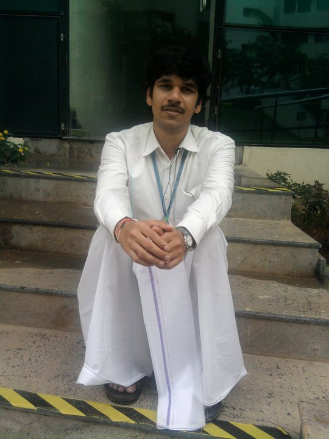

## The Definition

According to [Yogapedia](https://www.yogapedia.com/definition/5604/sushupti):

> Sushupti is a Sanskrit word meaning "deep sleep" and refers to one of the four states of consciousness in Hindu and yogic philosophy, sometimes called "deep sleep consciousness." It is also the third of the three avasthas, or states of the mind.

So, it is some eternal state of mind that gives us a lot of possitive effect on the mind, it awakens our inner energy, the core that nurtures our body and mind, so that it can cleanse us thoroughly from inside out.

## Modern man without it

As a modern man, I am bound to a job that I need to take up to feed my family (The existential crisis). This leaves me no space for my peaceful normal state, no chance for me to pick up a good book and try to understand my life, no opportunity to live a calm and purposeful life. I leave my culture, my traditions, my relatives, even sometimes my family members to work through my pays and soldier through the month.

So, eventually I get so stressed, it reflects in me taking more sick leaves due to health issues, irregular food and sleep timings, sleepless nights due to work and sometimes out of all the stress.

As a result, I try to vent out my stress in many forms, most of which are bad. I will be rude to my colleagues and family members, I make biased decisions in projects which are not supposed to be like that. I even get a lot of escalations which ultimately result in poor performance rating.

Occasionally, depending on the luck, I may get to go to dinner parties and dance-nights with teammates which might be a decent way to reduce my stress levels. Lack of such occasions will further stress me out after some time. Also, this includes a lot of money and people.

I become mechanical, laughing to jokes which don't amuse me, pleasing people who don't appeal to me and thinking too much about things that don't matter to me at all.

## Modern man with **Sushupthi**

As someone who knows Sushupthi and practices it regularly, I know many things:

- I know that the human body is not some unknown entity
- I know I can tame it, control it and even tune it for my benefits
- I know that sleep, food habits, attentiveness are all controllable items
- I know that practicing Sushupthi is not hard with experience
- I know productivity is boosted by many folds when Sushupthi is practiced
- I know that I can't be radical, can't be rash or irresponsible because of the presence of mind
- I know what happiness is, it is not in parties, dance-floors, engaging in ridiculous trash-talks, etc.
- I know that happiness is realizing the power within me, that it happens easily with the practice of Sushupthi

## Why is it important to know

> To know is to **understand**, to understand is to **practice**, to practice is to **perfect** it.

This **concept of Sushupthi** is not new, it is in fact the destiny of every Yogi that tries to attain this flawless state of mind.

For many centuries in India, the holy Yogis perfected this art of deep meditation that yielded them powers that we, as trivial humans, would not even begin to comprehend. Their body and mind were always in their control, thus allowing them to peek deep into the mysteries of the universe and themselves.

It is important to know that Sushupthi is one state of mind that is relatively easy to attain and is benificial in our day-to-day lives.

## How did they do it

### Why do we sleep?

Sleep enables our body's internal systems to cleans themselves, prepare themselves for the next day.

Without enough sleep, these internal systems are not fully rejuvinated and so we feel dull and disoriented.

### What truly rejuvinates our systems?

The three main phases of sleep are: **normal sleep**, **dreams** and **deep sleep or Sushupthi**.

Yes! The deep sleep that we all know about is infact the state of **Sushupthi**.

So, **Sushupthi** occurs everyday in our sleep. If we sleep for 8 hours, in that there would be atleast 2 hours of deep sleep. 

Modern technology (_smart watches_, _health bands_) can detect sleep patterns and report that back to us, so we know how many hours we were in deep sleep or **Sushupthi**.

We can notice in these reports that achieving this deep sleep is not happening immediately, it happens after some time, when the normal sleep and dreamy sleep are completed.

### How to achieve Sushupthi without sleep

Through meditation!

Yogis of India, while meditating, practiced achieving the state of **Sushupthi** while sitting in the yogic posture and not while sleeping.

This helped them sleep less and be more energetic automatically.

Because, they found:

> Having a sound mind and body daily is all about experiencing deep sleep for more number of hours and not about sleeping for more time.

Once they found this, the also found a bunch of other things.

- By practicing this Sushupthi for more than 8 hours (sometimes even 10, 12 or even 14 hours or more) per day allowed them to spend their remaining hours in the day happily.
- Sleep is not a thing for them anymore
- Food is not a thing for them anymore
- Sushupthi is their food, their sleep, their play-time, their everything.
- It is eternal bliss, it is the true state of the mind, they knew it.

As we know that a fresh mind can think wisely, a mind freshly out of Sushupthi can think the wisest of thoughts, can solve the most complex problems/questions in this world.

In other words, if you are able to completely be in Sushupthi day in and day out, you are nothing less than the God who created all of this.

But it is like reaching the speed of light.

> So, when we are enjoying bits of Sushupthi in our sleeps daily, its like we are driving a race car at 200mph. But when we do meditation and be in Sushupthi for more than 8 hours daily, its like warp speed, we see the future, the past and everything in between.

We don't go after drugs to keep our sanity, we don't vent our anger/frustration on others, we don't rely on artificial arrangements to control our stress levels, we don't lose control of our own lives.

## Conclusion

It is a less known fact that such a simple aspect of our life can play such a prominent role. It is sometimes not believable to the so called modern day professionals and experts almost as if nothing is believable to them except those materialistic aspects such as salary, leaves and food.

> Try it, learn it, experience it, extend it, go through it and make your life a perfect one.

